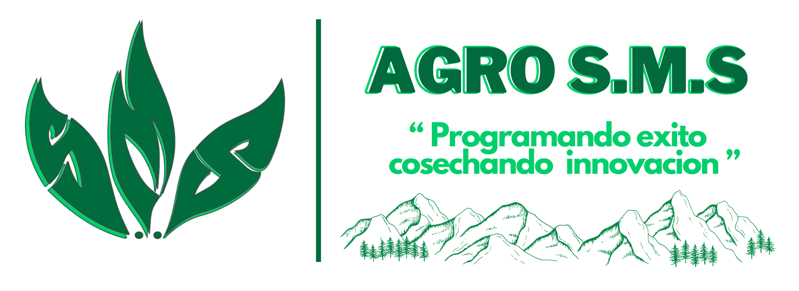

<p align="center">
  
</p>

# AGRO S.M.S


 AGRO S.M.S es un aplicativo web desarrollado en Laravel, bootstrap, ccs nativo y MySQL. Este sistema está diseñado para dar soluciones efectivas a enfermedades por las que este pasando los cultivos, dando tratamiento efectivo para combatir este problema, simplificando y automatizando el proceso de informacion a los agricultores. Proporciona informacion detallada con acceso rápido y sencillo a la información relevante de los principales cultivos de la region.

## Descripción del Proyecto

esta aplicación se basa en brindar información precisa a los agricultores sobre sus cultivos, prevención de plagas y enfermedades, en caso de que el cultivo ya este afectado la app ofrece soluciones con información sobre los mejores métodos de control, incluyendo pesticidas..

## Tecnologías Utilizadas

- **Laravel**: Framework PHP para el desarrollo de aplicaciones web.
- **BootstrapCSS**: Framework CSS para un diseño rápido y personalizable.
- **MySQL**: Sistema de gestión de bases de datos relacional.

## Instalación

Sigue estos pasos para configurar el proyecto en tu entorno local:

1. Clona el repositorio:
   ```bash
   git clone https://github.com/jfscalante/AGRO_S.M.S.git
   cd AGRO_S.M.S
   ```

2. Instala las dependencias de PHP y JavaScript:
   ```bash
   composer install
   npm install
   ```

3. Configura el archivo `.env`:
   ```bash
   cp .env.example .env
   php artisan key:generate
   ```

4. Configura la base de datos en el archivo `.env`:
   ```env
   DB_CONNECTION=mysql
   DB_HOST=127.0.0.1
   DB_PORT=3306
   DB_DATABASE=agrosms
   DB_USERNAME=tu_usuario
   DB_PASSWORD=tu_contraseña
   ```

5. Ejecuta las migraciones y los seeders:
   ```bash
   php artisan migrate --seed
   ```

6. Inicia el servidor de desarrollo:
   ```bash
   php artisan serve
   npm run dev
   ```

## Uso

Accede a la aplicación en tu navegador a través de `http://localhost:8000/admin`. Desde allí, podrás gestionar toda la informacion del aplicativo dandote una amplia rama de opciones para editar, eliminar, agregar y actualizar toda la informacion existente.

## Contribuidores

El proyecto fue desarrollado por los aprendices **Miguel Angel Suarez Fajardo** , **Jimmy Fabian Scalante Claros** y **Duvan Alfonso Monroy Bermudez**, bajo la supervisión del instructor **Héctor D. Toledo García**.

## Licencia

Este proyecto está licenciado bajo la Licencia MIT. Consulta el archivo [LICENSE](LICENSE) para más detalles.

---

¡Gracias por utilizar AGRO S.M.S! Si tienes alguna pregunta o sugerencia, no dudes en contactarnos.
